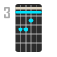

# Chordao

<p align="center">
  <a href="./README.md">简体中文</a> · <strong>English</strong>
</p>

<p align="center">
  
</p>

<p align="center">
  <strong>Guitar chord visualizer based on E/Em/A/Am shape derivation</strong>
</p>

<p align="center">
  <a href="https://w-mai.github.io/chordao/">
    
  </a>
  <a href="https://github.com/W-Mai/chordao/blob/main/LICENSE">
    
  </a>
  <a href="https://github.com/W-Mai/chordao/actions">
    
  </a>
</p>

Pick a key, see all 6 diatonic chords (I, IIm, IIIm, IV, V, VIm) across the fretboard — with the optimal movement path highlighted.

## 📖 Table of Contents

- [How It Works](#-how-it-works)
- [Features](#-features)
- [Views](#-views)
- [Practice Game](#-practice-game)
- [Dev](#-dev)
- [Stack](#-stack)
- [License](#-license)

## 🎸 How It Works

Every guitar chord can be derived from just **4 open shapes** — E, Em, A, Am — by sliding them up the neck with a barre:

```
Open A chord          →  Barre at fret 3  →  C chord (A shape @ fret 3)
x 0 2 2 2 0              x 3 5 5 5 3
```

The **Shape Grid** maps this visually — two rows (A/Am shapes on top, E/Em on bottom), with each column representing a fret position:

<p align="center">
  
</p>

Filled dots = recommended optimal path. Outlined = alternative positions. The animated dot traces the Pop Canon progression (1→5→6→4) in a loop.

Chordao finds the **optimal combination** of shapes that minimizes hand movement across all 6 diatonic chords, using circle-of-fifths ordering. You can expand to the full **CAGED** (C/A/G/E/D) system for more position coverage.

## ✨ Features

### Core Visualization
- **Shape derivation** — Chords derived by moving open-chord shapes up the neck with a barre. Switch between two shape systems:
  - **E/Em/A/Am** (default, 2 shapes — simple and clean)
  - **CAGED** (C/A/G/E/D, 5 shapes — full neck coverage)
- **Triad ↔ 7th toggle** — E/Em/A/Am ↔ E7/Em7/A7/Am7 (or CAGED equivalents)
- **Optimal path** — Auto-highlights the 6-chord combination with minimum hand movement
- **Multiple position combos** — Switch between distinct position sets with numbered buttons, or `All` to see every path overlaid
- **Bass direction preference** — ↗ ascending / ↘ descending / — none biases the search for progressions that move up or down the neck

### Music Theory Overlays
- **Interval labels** — Active chord shows R/3/5/b3/b7 on each dot
- **Interval map mode** — Toggle ♫ to overlay all intervals (R/b3/3/4/5/b7/7) for the current key across the entire neck
- **Interval geometry arrows** — Click a root on the fretboard to see arrows + semitone shifts to adjacent-string intervals
- **Chord diagram labels** — Shows `I · E @ 8` format (degree · shape · fret)

### Practice Games (see [Practice Game](#-practice-game))
- 6 modes × 3 difficulties with per-question timer, streak tracking, and local best scores

### Song Sheets (see [Song Sheets](#-song-sheets))
- Lyric + bar-aligned chord charts; degree-colored accents; built-in songs live as `.md` files in `songs/`
- WYSIWYG editor (click character → accent, click chip → degree), localStorage archive, link + image sharing
- Playback: ▶/⏸/⏹, sheet-level BPM, time signature (3/4, 6/8, …), per-section rhythm override; click any chip to set the play cursor and start bar-aligned

### Progressions & Audio
- **Built-in progressions** — Pop Canon, Blues, C-Pop Ballad, Jazz ii-V-I, etc., with animated path visualization
- **Custom progressions** — Type your own degree sequence (e.g. `1 4 5 1`), synced to URL
- **Chord audio** — Click any chord to hear it (Web Audio API, harmonic-series synthesis, rhythm patterns)

### Interaction & Export
- **Interactive highlight** — Click to play, double-click to lock; all views (Shape Grid / Fretboard / Diagrams) sync
- **Keyboard shortcuts** — ← → switch keys, 1–6 filter degrees, 0/Esc reset
- **Shareable URLs** — Key, progression, and panel settings (combo index, bass-direction preference, interval-map state, fullscreen panel) all encoded in URL hash; defaults are omitted to keep URLs tidy
- **Panel fullscreen** — Click ⛶ to expand Shape Grid or Fretboard to fullscreen; all header controls (combo switch, interval filter chips, etc.) remain usable inside the overlay
- **Export PNG** — Dedicated layout with QR codes (linking to current state), progression info, and shape-system-aware legend
- **3 themes** — Catppuccin Mocha (dark), Latte (light), Cyber (neon) with system auto-detection
- **Circle of fifths / Chromatic** — Switch key ordering
- **Barre display toggle** — Optional barre line on chord diagrams
- **PWA** — Installable, works offline
- **i18n** — English / 中文, auto-detected
- **Interactive guide** — Step-by-step visual tutorial on first visit

## 🎯 Views

### Shape Grid

A compact fretboard showing where each chord lives. Filled = recommended, outlined = alternative. When a progression is selected, an animated dot traces the movement path; in `All` mode every combo's path is drawn in a distinct color.

- **E/Em/A/Am** system: 2 rows — top = A/Am, bottom = E/Em
- **CAGED** system: 3 rows — A/C, E/G, D shape (top to bottom)
- Column number = barre fret position

### Fretboard Overview

Full 17-fret fretboard with all voicings plotted, plus optional overlays:

- ⬤ **Circle** = E/Em shape root-on-6th-string (E/G in CAGED)
- ◼ **Square** = A/Am shape root-on-5th-string (A/C in CAGED)
- ◆ **Diamond** = D shape root-on-4th-string (CAGED only)
- Consecutive same-fret dots merge into barre bars on hover
- Click any chord to play, double-click to lock highlight across all views
- **Interval labels** — when a chord is active, each dot shows its interval (R/3/5/b3/b7)
- **Interval map mode** — toggle ♫ to overlay all intervals for the current key; click any interval chip to filter (R/b3/3/4/5/b7/7)
- **Interval geometry arrows** — click a root on the fretboard to see arrows + semitone shifts to adjacent-string intervals

### Chord Diagrams

Standard chord box notation for each voicing:

- Vertical lines = strings (E A D G B e)
- Horizontal lines = frets
- Dots = finger placement, bar = barre
- × = muted, ○ = open
- Header label: `I · E @ 8` — degree · shape · barre fret

## 🎼 Song Sheets

Click the 🎼 button in the header to open a song sheet panel. Each row lays out 4 bars across the neck, each bar gets a degree-colored header, and one character per bar can be marked as the **accent** (where the chord lands).

### Built-in songs

Song sheets live in the repo's root `songs/` directory as plain `.md` files. To add a song, drop a file like `songs/mysong.md` — it shows up in the dropdown at next build/dev-reload. Example:

```md
---
title: My Song
key: C
strum: pop
bpm: 144
time: 4/4
---

--- verse | strum:pop ---
lyric[l]ine one | more[l]yrics | and[s]o on | fill[4]bars @ 1 3m 6m 4

--- chorus | strum:whole ---
the[d]arkest night | the[l]oneliest walk | the[b]rightest stars @ 1 3m 6m
```

- YAML frontmatter: `title` / `key` / `strum` / `bpm` / `time` (`time` and `bpm` optional; time signature defaults to 4/4)
- `--- section name | strum:pop ---` starts a section; the `strum:xxx` suffix is optional and overrides rhythm for that section
- `|` separates bars; `@ 1 3m 6m 4` lists one degree per bar; multiple chords in one bar are split with `/` (e.g. `@ 1/4` means first half 1, second half 4)
- `[X]` marks X as the accent character (shown in the degree's color)

### Playback

- **▶/⏸/⏹** — Playback follows per-section strum + sheet BPM + time signature; the current chord lights up on the chart and the right-side views (Shape Grid / Fretboard / Chord Diagrams) sync
- **Click any chip** — Pins the play cursor there; **▶** starts from the **beginning of that chord's bar** (bar-aligned); **⏸** keeps the cursor, next ▶ resumes from the exact pause point; **⏹** clears the cursor and resets to the start
- **Section-focused progression** — Hovering a section (or playback being inside it) switches the right-side ShapeGrid's connecting lines and synced dot to that section's chord progression

### Visual editor

Click **New** / **Edit** in the panel header to open the editor. It's fully WYSIWYG: click a chord chip to pick a degree, click a character to toggle its accent, double-click a bar to edit the lyrics. Add / rename / delete sections and lines inline. A **View source** button reveals the raw `.md` text for power users.

### User songs & sharing

- User-authored songs live in `localStorage` under the `user:<slug>` id prefix
- The ↗ button in the song panel header opens a share menu:
  - **🔗 Copy link** — bakes the current sheet into the URL hash (deflate-raw + base64url); another browser opening it auto-imports the sheet to localStorage
  - **📷 Export image** — generates a full-layout PNG (key badge, title, meta, sheet body, attribution footer), matching the main-app export style

## 🎮 Practice Game

6 game modes to train fretboard knowledge:

| Mode | Description |
|------|-------------|
| 🎯 **Locate** | Given a degree, find it on the fretboard |
| 🔮 **Identify** | Given a highlighted chord, guess its degree |
| ⚡ **Sprint** | Find all 6 diatonic chords as fast as possible |
| 🔗 **Chain** | Follow the circle-of-fifths order on the fretboard |
| 👁 **Memory** | Chord flashes briefly, then find it from memory |
| 🎵 **Interval** | Given a root position, find a target interval (b3/3/5/b7/…) |

3 difficulty levels per mode:
- ⭐ Easy — colored hints, limited degrees (or simpler intervals)
- ⭐⭐ Medium — no colors, I/IV/V (or common intervals)
- ⭐⭐⭐ Hard — no colors, all 6 degrees, shorter timer

Per-question countdown timer, streak tracking, and local best score leaderboard (saved per mode × difficulty).

## 🛠 Dev

```bash
bun install
bun run dev
```

### Scripts

| Command              | Description                             |
| -------------------- | --------------------------------------- |
| `bun run dev`        | Start dev server                        |
| `bun run build`      | Type check + build                      |
| `bun run lint`       | ESLint (includes i18n string detection) |
| `bun run format`     | Prettier format                         |
| `bun run check-i18n` | Verify translation key consistency      |
| `bun test`           | Unit tests (chord data layer)           |

### Project Structure

```
songs/          — Built-in song sheets (.md files with YAML frontmatter); drop a new file to add a song
src/
  components/
    game/       — Per-mode game state hooks + pure logic
    *.tsx       — UI components (ShapeGrid, Fretboard, ChordDiagram, Game, Guide, ExportView,
                  SongSheetPanel, SongEditor, VisualSongEditor, …)
  data/
    songs/      — import.meta.glob loader for /songs/*.md
    songSheet.ts         — SongSheet/Section/Line/Bar types + parseBarSource
    songSheetText.ts     — UG-ish text parser + serializer (frontmatter + `|`/`@` body)
    songStorage.ts       — localStorage archive (listUserSongs/saveUserSong/deleteUserSong)
    songShare.ts         — lz-string URL payload (encodeSheetForUrl/decodeSheetFromUrl)
    chordData.ts         — Chord data layer (shapes, derivation, optimal-combo search, interval maps)
  hooks/        — Shared hooks (useHashState for URL-hash sync)
  utils/        — Audio synthesis, QR code generation
  i18n/         — Translation files (en/zh)
tests/          — Unit tests for the data/algorithm layer
```

## 🏗 Stack

React + TypeScript + Vite + Tailwind CSS v4 + i18next + Web Audio API + vite-plugin-pwa + Bun

## 📄 License

MIT
