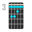

# Chordao

<p align="center">
  
</p>

<p align="center">
  <strong>Guitar chord visualizer based on E/Em/A/Am shape derivation</strong>
</p>

<p align="center">
  <a href="https://w-mai.github.io/chordao/">
    
  </a>
  <a href="https://github.com/W-Mai/chordao/blob/main/LICENSE">
    
  </a>
  <a href="https://github.com/W-Mai/chordao/actions">
    
  </a>
</p>

Pick a key, see all 6 diatonic chords (I, IIm, IIIm, IV, V, VIm) across the fretboard — with the optimal movement path highlighted.

## 📖 Table of Contents

- [How It Works](#-how-it-works)
- [Features](#-features)
- [Views](#-views)
- [Dev](#-dev)
- [Stack](#-stack)
- [License](#-license)

## 🎸 How It Works

Every guitar chord can be derived from just **4 open shapes** — E, Em, A, Am — by sliding them up the neck with a barre:

```
Open A chord          →  Barre at fret 3  →  C chord (A shape @ fret 3)
x 0 2 2 2 0              x 3 5 5 5 3
```

The **Shape Grid** maps this visually — two rows (A/Am shapes on top, E/Em on bottom), with each column representing a fret position:

<p align="center">
  
</p>

Filled dots = recommended optimal path. Outlined = alternative positions. The animated dot traces the Pop Canon progression (1→5→6→4) in a loop.

Chordao finds the **optimal combination** of shapes that minimizes hand movement across all 6 diatonic chords, using circle-of-fifths ordering.

## ✨ Features

- **Shape derivation** — All chords derived from E/Em/A/Am via barre transposition, up to 17 frets
- **Optimal path** — Auto-highlights the most efficient 6-chord combination (minimum hand movement)
- **Chord progressions** — Built-in presets (Pop Canon, Blues, C-Pop Ballad, etc.) with animated path visualization
- **Interactive highlight** — Hover to preview, click to lock, all views sync simultaneously
- **3 themes** — Catppuccin Mocha (dark), Latte (light), Cyber (neon) with system auto-detection
- **Barre display** — Toggle barre line visualization on chord diagrams
- **Circle of fifths / Chromatic** — Switch key ordering
- **Export PNG** — Dedicated layout with QR codes, progression info, and legend
- **PWA** — Installable, works offline
- **i18n** — English / 中文, auto-detected from browser
- **Keyboard shortcuts** — ← → switch keys, 1-6 filter degrees, 0/Esc reset
- **Interactive guide** — Step-by-step visual tutorial on first visit

## 🎯 Views

### Shape Grid

A compact 2-row fretboard showing where each chord lives. Filled = recommended, outlined = alternative. When a progression is selected, an animated dot traces the movement path.

- Top row: A / Am shapes
- Bottom row: E / Em shapes
- Column number = barre fret position

### Fretboard Overview

Full 17-fret fretboard with all voicings plotted:

- ⬤ **Circle** = E/Em shape
- ◼ **Square** = A/Am shape
- Consecutive same-fret dots merge into barre bars on hover
- Hover/click any chord to highlight across all views

### Chord Diagrams

Standard chord box notation for each voicing:

- Vertical lines = strings (E A D G B e)
- Horizontal lines = frets
- Dots = finger placement, bar = barre
- × = muted, ○ = open
- Double-click to expand

## 🛠 Dev

```bash
bun install
bun run dev
```

### Scripts

| Command              | Description                             |
| -------------------- | --------------------------------------- |
| `bun run dev`        | Start dev server                        |
| `bun run build`      | Type check + build                      |
| `bun run lint`       | ESLint (includes i18n string detection) |
| `bun run format`     | Prettier format                         |
| `bun run check-i18n` | Verify translation key consistency      |

## 🏗 Stack

React + TypeScript + Vite + Tailwind CSS v4 + i18next + vite-plugin-pwa + Bun

## 📄 License

MIT
